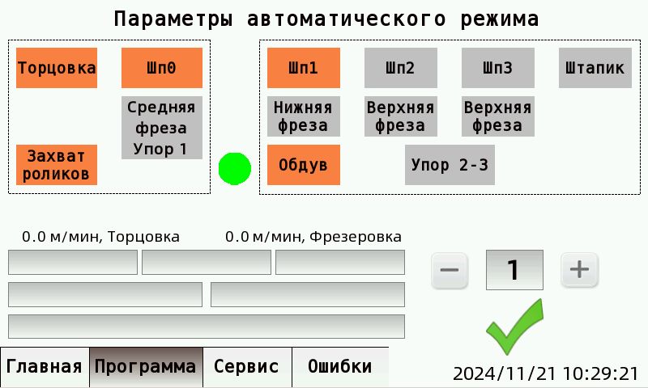
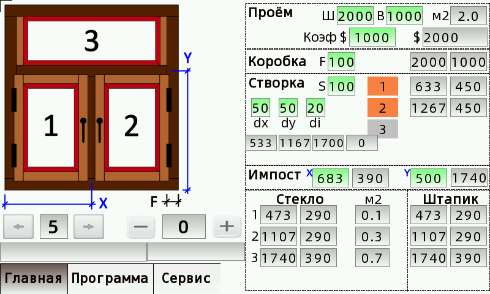
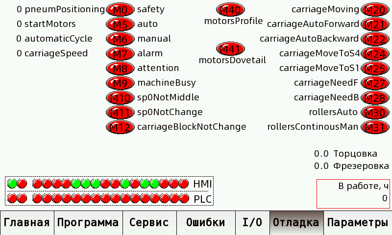
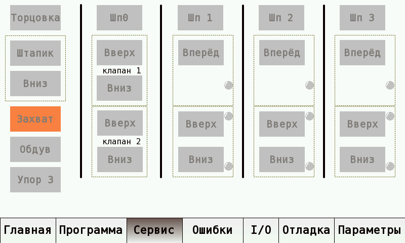

# Проект замены ПЛК на станке OKOMA UF 3S

- Производитель станка: OKOMA GmbH
- Модель: UF 3S
- Год изготовления: 1984

## Использованное оборудование

- ПЛК: HCFA HCA8-32X32YR-A (китайский клон Mitsubishi FX3U)
- Дополнительный модуль 8-входов/8-выходов: HCA8C-8EX8EYR
- Блок питания для модуля входов/выходов: HCA8C-CNV5V-TX2N
- Панель оператора (HMI) HCFA TP2507 (китайский клон Flexem)
- Блок питания для HMI и датчиков: 24VDC 1.5A

## Программное обеспечение

- Составление электрической схемы: KiCAD 8.0
- Программирование ПЛК: GX Works2 1.622Y (Structured text)
- Программирование HMI: HCTDesigner 2.5.10743.0 (Flexem FStudio)

   
